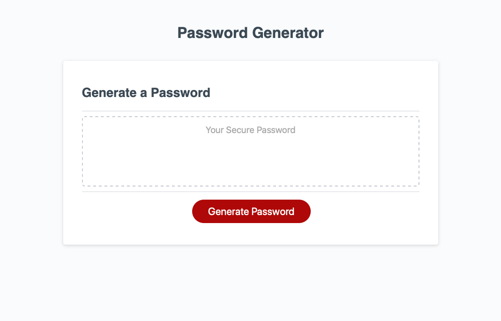

# Password Generator

## Description
Here I added the nessesary javascipt to a website template that generates a random password. In addition with various promts to inculde speical characters, upper or lower case letters, and numbers. ([Visit the website here.]( https://devontehillman.github.io/passwordgenerator/./)) In order to achive this I have:
* Added a function that alerts the user.
* Added if statments to concatenate a string from the users prefferences.
* Retruned the generated password to be displayed the webpage. 
 

## Finished-Page

## What did I learn?
In this project I learned:
* How link a function in java script to an html. 
* How use the getrandom function to generate a random password. 
* How to return a value from javascript to html. 
* How a .addEventListener works.
* How this project would relate to working in a team where others create the Html and CSS while I do the Java script.

